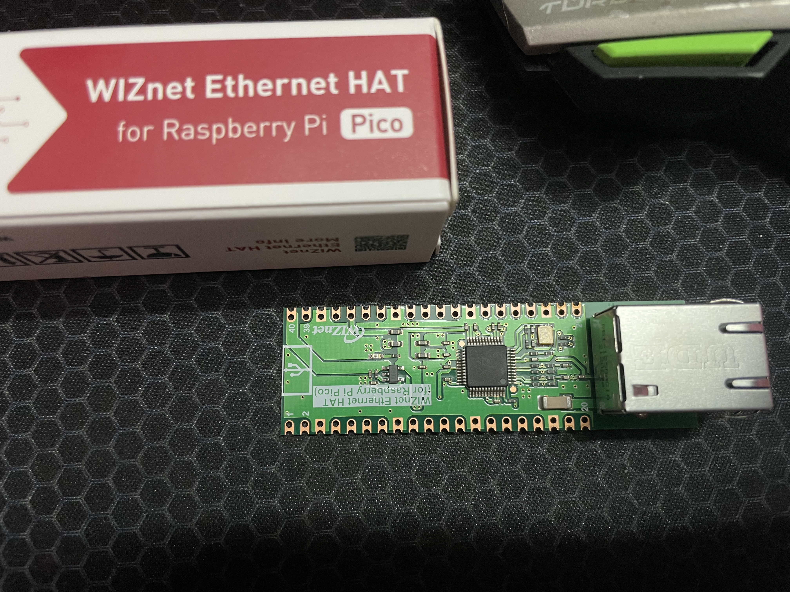
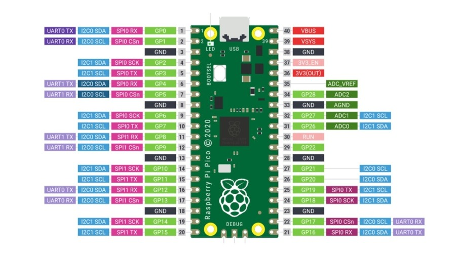
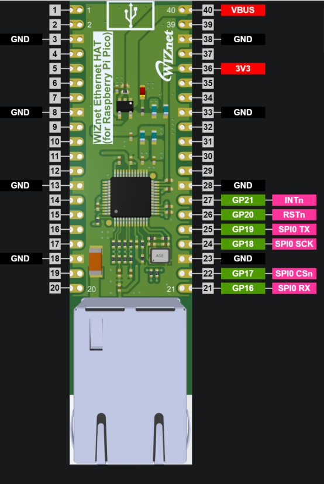
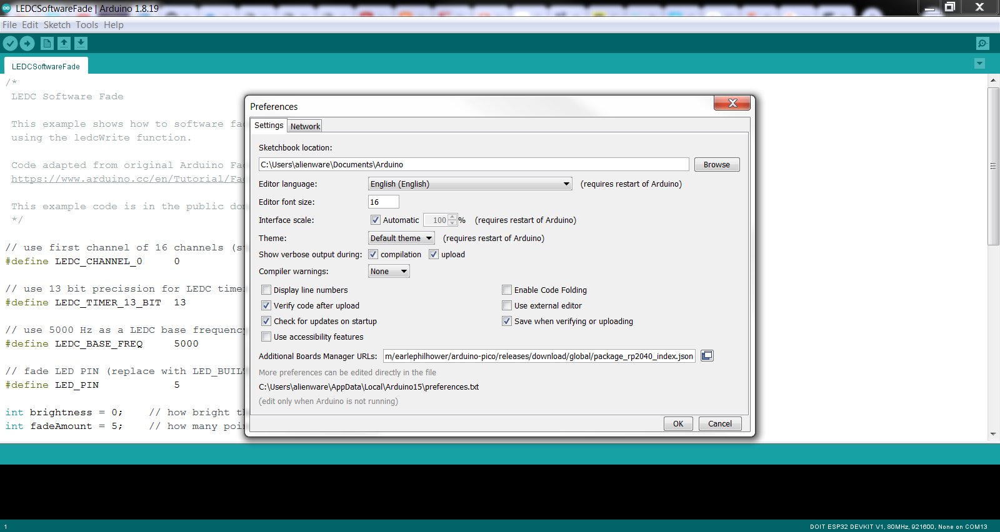
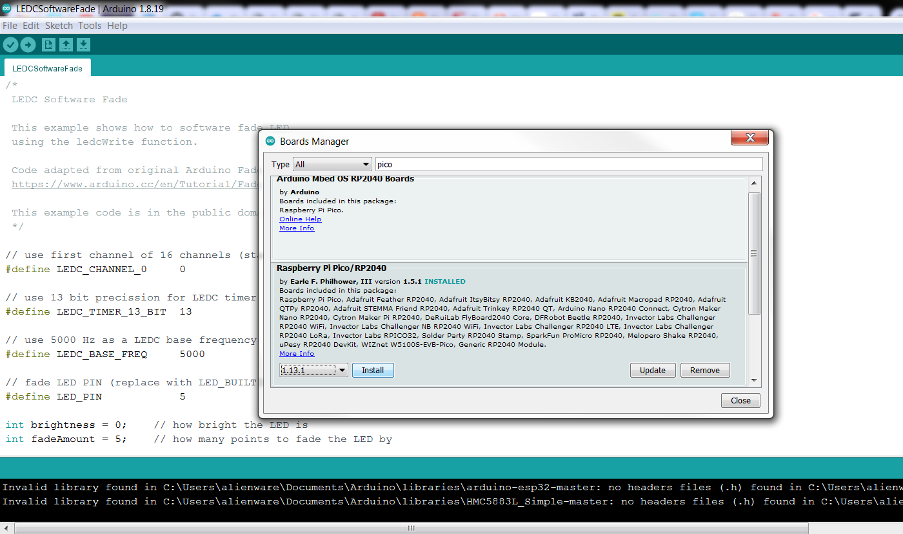
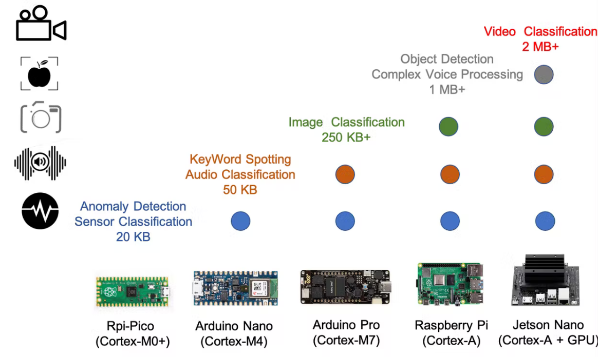
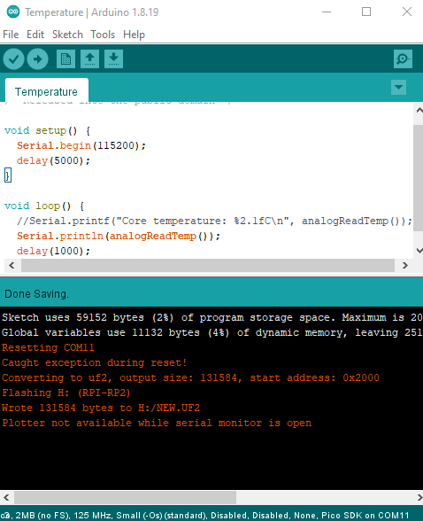
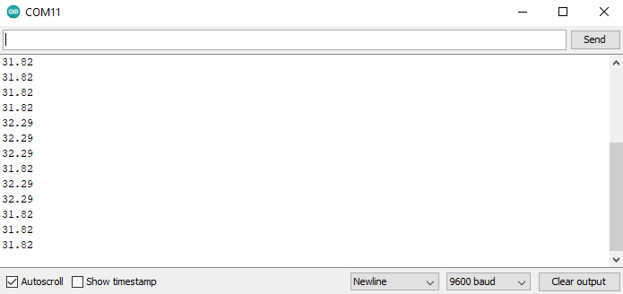

# Real-time Lab monitoring using TinyML
# by Rahul Khanna D

RP2040 temperature monitor using WIZnet Ethernet HAT and edgeimpulse. 


## Why Did We Build This? & The Solution

Prevention is better than cure" is one of the effective measures to prevent the spreading of COVID-19 and to protect mankind. Many researchers and doctors are The maintenance of the ambiance in places such as laboratories, especially chemical labs is essential. The temperature and humidity have to be monitored continuously and the level of air quality and heat levels are used as an interrupt to prevent laboratory accidents. The data from the sensors are fed to an ML algorithm to identify an anomaly and inform the security team via email. 

## Requirements

### Hardware

* Raspberry Pi Pico 
* WIZnet Ethernet HAT
* DHT22 Temperature Sensor (optional)
* microUSB cable
* LAN cable
* 1S Li-ion Power bank

### Software

*   Arduino IDE 1.8.9
*   Edge Impulse Studio
*   lib to be added


## Basic Hardware Components
  
### Raspberry Pi Pico

  Raspberry Pi Pico is a low-cost, high-performance microcontroller board with flexible digital interfaces. Key features include:

* RP2040 microcontroller chip designed by Raspberry Pi Foundation
* Dual-core Arm Cortex M0+ processor, flexible clock running up to 133 MHz
* 264KB of SRAM, and 2MB of on-board Flash memory
* USB 1.1 with device and host support
* Low-power sleep and dormant modes
* 26 × multi-function GPIO pins
* 2 × SPI, 2 × I2C, 2 × UART, 3 × 12-bit ADC, 16 × controllable PWM channels
* Accurate clock and timer on-chip
* Temperature sensor
* Accelerated floating-point libraries on-chip
* 8 × Programmable I/O (PIO) state machines for custom peripheral support

  
  
## WIZnet Ethernet HAT
  
  WIZnet Ethernet HAT (Hardware Attached on Top) is a Raspberry Pi Pico pin-compatible board that utilizes W5100S and supports both 3.3V & 5V.

  Please refer to this link to find more information about W5100S.

* Raspberry Pi Pico Pin-Compatible
* Ethernet (W5100S Hardwired TCP/IP CHIP)

  

Features

* Includes W5100S
* Supports Hardwired Internet Protocols: TCP, UDP, WOL over UDP, ICMP, IGMPv1/v2, IPv4, ARP, PPPoE
* Supports 4 Independent Hardware SOCKETs simultaneously
* Internal 16 Kbytes Memory for TX/ RX Buffers
* Operation Voltage 3.3V / 5V - Built-in LDO (LM8805SF5-33V)
* SPI Interface 5V I/O tolerance
* 10 / 100 Ethernet PHY embedded
* Supports Auto Negotiation - Full / Half Duplex, 10 / 100 Based
* Built-in RJ45 (RB1-125BAG1A)
  
## Connections
  
  Solder the female berg sticks to the Raspbeery Pi Pico as shown below. 


  Attach the WIZnet Ethernet Hat to the Raspberry Pi Pico as shown. 
  

  
Now the connection are done. We will be using the internal temperature sensor from the Raspberry Pi Pico for data collection. 

## IDE setup 

  The next step is to add the Raspberry Pi Pico to the Arduino IDE. This is done by the following steps. First, copy the following text
  " https://github.com/earlephilhower/arduino-pico/releases/download/global/package_rp2040_index.json " and paste it to the File->Preferences and click OK. 
  

  
  Once done, go to Tools -> Boards -> Boards Manager and type "pico" in the search box. Install the Raspberry Pi Pico / RP 2040 board to the IDE. 

  

Now the board is installed to the Arduino IDE.

## TinyML on Raspberry Pi Pico 
The main idea of this project is to use Raspberry Pi pico to detect some anomaly on the temperature data and the entire classification is done on the RP2040 MCU. 

Depending on the hardware capacity and memory size, different types of MCU/Application can be used in the TinyML, as shown in the bellow chart.



To run a machine learning model on the Raspberry Pi pico, we need the ambient temperature data. Since the Raspberry Pi Pico has internal temperature sensor, we use them to collect the temperature data. The ARM Cortex M0+ is suitable for the Anomaly Detection and Sensor Classification which allows us to implement this project. 

**Data Collection from Sensor**
The First step is to collect the temperature data from the internal temperature sensor. Data is loaded using the built-in CLI which reads the sensor data from Pico's serail port. We can also import the data in the form of CSV or JSON file format. 

Arduino Code to read internal temperature and send data via serial port
```
void setup() {
  Serial.begin(115200);
  delay(5000);
}

void loop() {
  Serial.println(analogReadTemp());
  delay(1000);
}
```
  


Output Printed on Serial Monitor
  

## Working of the Project 🔭

To test the real-time scenario, we deployed it on one of the rooms to test how possibly it could be used and the results were pretty affirmative.   
  


*If you faced any issues in building this project, feel free to ask me. Please do suggest new projects that you want me to do next.*

*Share this video if you like.*

*Happy to have you subscribed: https://www.youtube.com/c/rahulkhanna24june?sub_confirmation=1*

**Thanks for reading!**
